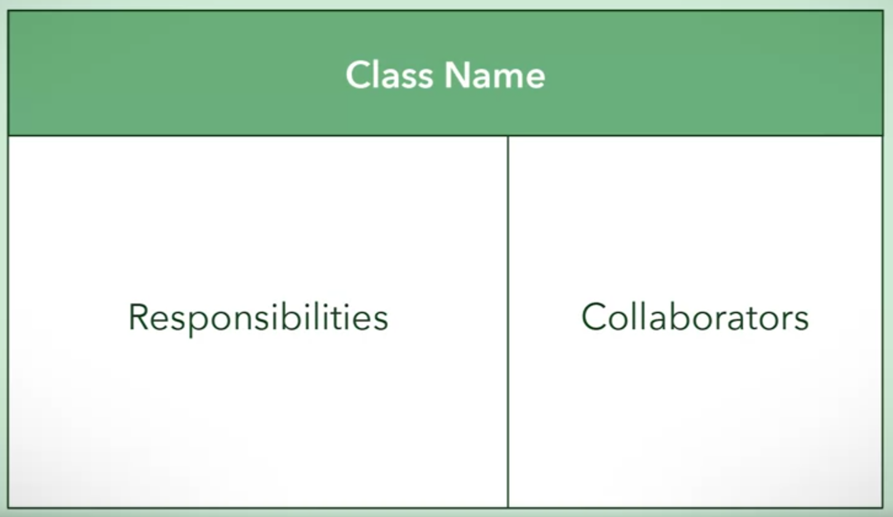
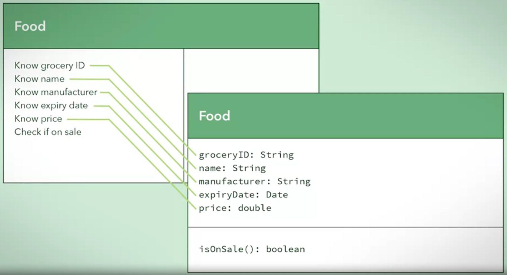
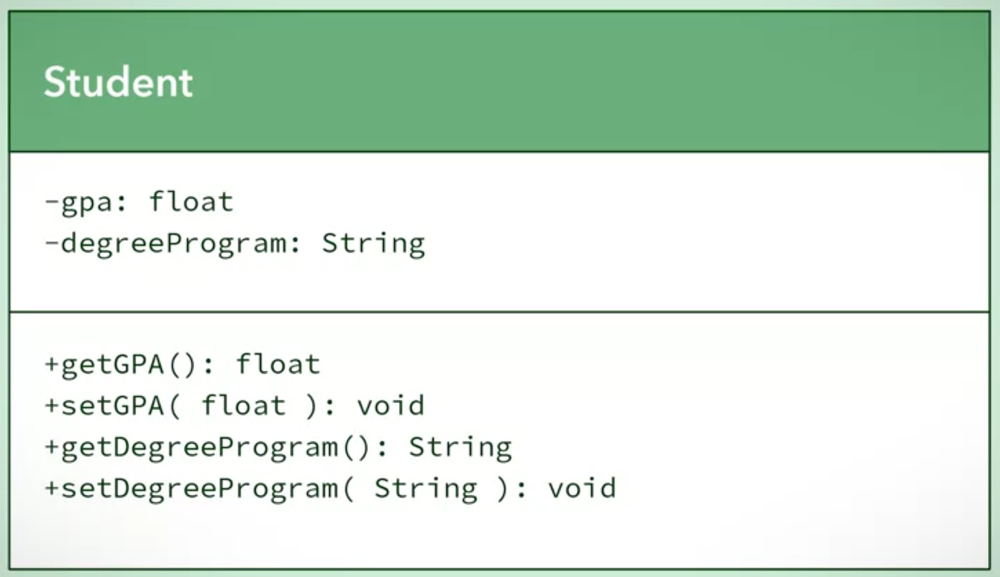

# Introduction to Software Design and Architecture

# Module 1

### User Story
 <p>This helps us to determine the object </p>
    
    As a ___, I wan to ___, so that ___


### Desired Characteristic of Software Design
- Reusability
- Maintainability
- Flexible

<br>

### Two Design Process
- Conceptual Design
    - Class Responsibilities Collaborator (CRC)
- Technical Design

<br>

 <center>CRC Table </center> 



<br><br>


# Module 2: Object-Oriented Design


Object-Oriented Design consists of:
- Conceptual Design use **object-oriented** analysis to identify key object to break down
- Technical Design to refine further details, such as attribute and behaviours

<br>

Categories of objects involve:
- **Entity objects**, where initial focus during the design is
placed in the problem space
- **Control objects** that receive events and co-ordinate actions
as the process moves to the solution space
- **Boundary objects** that connect outside services to your
system, as the process moves towards the solution space

Unified Modelling Language (UML):
- visual notation used to express software models


## 1. Describe issues in creating models for design.
## 2. Understand how programming languages evolved toward object orientation.
## 3. Four major design principles used in object-oriented modelling:

- Abstraction
    - Abstraction breaks a concept down into a 
    simplified description that ignores unimportant details and emphasizes the essentials needed for the concept
    - Rule of Least Astonishment
    - To sum up: only capture the important/essential information
    - Essential characteristic of abstraction: 
        - attribute and behaviour

- Encapsulation
    - This principle involves a concept that allows 
    something to be contained in a capsule, some of which you can access from the outside and some of which you cannot.
    - There are three ideas behind encapsulation. These are:
        - The ability to “bundle” attribute values (or **data**) and behaviours (or **functions**) that manipulate those values, into a self-contained object.
        - The ability to “expose” certain data and functions of that object, which can be accessed from other objects, usually through an interface.
        - The ability to “restrict” access to certain data and functions to only within the object.
    - Encapsulation helps in code update, such as updating the attribute and not affect the class methods. User will not know about the code update
    - Encapsulation achieves an abstraction barrier through black box thinking where the internal workings of a class are not relevant to the outside world.

- Decomposition
    - Definition: It consists of taking a whole thing, and dividing it into different parts.
    - Note that a part can also serve as a whole, which is made up of further constituent parts. For example, a kitchen is a part of a house. But the kitchen may be made up of further parts, such as an oven and a refrigerator.

- Generalization
    - In coding, algorithmic behaviours are often modelled through **methods**. A method allows a programmer to generalize a behaviour, so the behavior can be applied to different input data. This generality reduces the need to have identical code throughout a program.
    - Object-oriented modelling achieves generalization by classes through inheritance.
    - This allows you to have two kinds of classes: a parent class, and a child class. Child classes inherit attributes and behaviours of parent classes. This means that repeated, common, or shared characteristics go into parent classes. Parent classes capture general ideas and generally have broader application.
    - In standard terminology, a parent class is known as a superclass and a child class is called a subclass
    - Generalization provides more robust software solutions and allows for more reusable code because the same blocks of code can be used for different classes.


<br>

    Abstraction: Rule Of Least Astonishment

    The abstraction captures the essential attributes and behaviour for a concept with no surprises and no definitions that fall beyond its csope. You dont want to surprise anyone trying to understand your abstraction with irrelevant themself

## 4. Express the above design principles in using UML class diagrams and Java code.

### Design Structure in Java and UML Class Diagrams
- Abstraction

 <br> 

- Encapsulation
    - getter and setter
 <br> 
- Decomposition (3 types of relationship)
    - Association
        - indicate loose relationship, independent from each other.
        - if one object is destroyed, then the other object continues to exist
    - Aggregation
        - is a "has a" relationship, where a whole has parts that belong to it.
        - weak relationship
        - This means that although parts can belong to wholes, they can also exist independently.
    - Composition
        - Composition is one of the most dependent of the decomposition relationships.
        - his relationship is an exclusive containment of parts, otherwise known as a strong “has-a” relationship. In other words, a whole cannot exist without its parts, and if the whole is destroyed, then the parts are destroyed too.
        - A good example is house and room
    - Generalization
        - Protected attributes in Java can only be accessed by:
            - the encapsulated class itself
            - all subclasses
            - all classes within the same package
        - In Java, a package is a way to organize classes into a namespace that represents those classes.
        - Abstract
            - Since the Animal class is a generalization, it should not be created as an object on its own. The keyword <u>**abstract**</u> indicates that the class cannot be <u>**instantiated**</u>. In other words, an Animal object cannot be created.
            - See code block #1
        - Inheritance
            - Inheritance is declared in Java using the keyword <u>**extends**</u>. Objects are instantiated from a class by using constructors.
            - **Only one inheritance is allowed in Java**, while C++ allow multiple inheritance. Avoid **data ambiguity** 
        - Constructor
            - Classes can have implicit constructors or explicit constructors.
                - implicit: All attributes are assigned zero or null when using the default constructor. - See code block #2
                - Explicit constructors allow you to assign values to attributes during instantiation. - See code block #3
            - To access the superclass’ attributes, methods, and constructors, the subclass uses the keyword <u>**super**</u>.
        - Interface
            - Java addresses the restriction of single implementation inheritance by offering **interface inheritance**.
            - A Java interface also denotes a type, but an interface only declares method signatures, with no constructors, attributes, or method bodies. It specifies the expected behaviours in the method signatures, but it does not provide any implementation details.
            - In Java, the keyword interface is used to indicate that one is being  defined. The letter “l” is sometimes placed before an actual name to indicate an interface.
            - In order to use an interface, you must declare that you are going to fulfill the contract as described in the interface. The keyword in Java for this action is <u>**implements**</u>.
            - Like abstract classes, which are classes that cannot be instantiated, interfaces are a means in which you can achieve polymorphism
            - See code block #4
        - Polymorphism
            - In OOP, polymorphism is when two classes have the same description of a behaviour, but the implementations of that behaviour may be different. see code block #5
            - Interface A should only inherit from interface B if the behaviours in interface A can fully be used as a substitution for interface B. e.g. car can move X and Y axis, but plane can move X, Y and Z. So plane can inherit from car, and then add Z.

```
// Code block #1
// Java Code for Generalization above

public abstract class Animal {
    protected int numberOfLegs;
    protected int numberOfTails;
    protected String name;
    public Animal( String petName, int legs, int tails ) {
        this.name = petName;
        this.numberOfLegs = legs;
        this.numberOfTails = tails;
    }
    public void walk() { … }
    public void run() { … }
    public void eat() { … }
}
```
---
```
// // Code block #2
// Below is an example of an implicit constructor

public abstract class Animal {
    protected int numberOfLegs;
    public void walk() { … }
}

```
---
```
// // Code block #3
// Below is an example of an explicit constructor:

public abstract class Animal {
    protected int numberOfLegs;
    public Animal( int legs ) {
        this.numberOfLegs = legs;
    }
}
```
---
```
// // Code block #4
// Demonstration for Interface inheritance
// The letter “l” is sometimes placed before an actual name to indicate an  
// interface.

public interface IAnimal {
    public void move();
    public void speak();
    public void eat();
}

public class Lion implements IAnimal {
/* Attributes of a lion can go here */
    public void move() { … }
    public void speak() { … }
    public void eat() { … }
}
```
```
// // Code block #5

public class Lion implements IAnimal {
    public void speak() {
    System.out.println( "Roar!" );
    }
}
public class Wolf implements IAnimal {
    public void speak() {
    System.out.println( "Howl!" );
    }
}
```
<br>


## 5. Explain and express implementation inheritance.
## 6. Explain and express interface inheritance.


